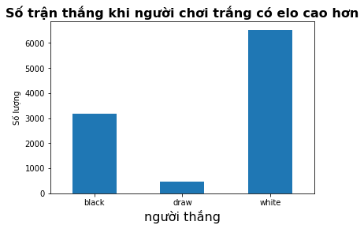

<!-- #region slideshow={"slide_type": "slide"} -->
# Báo cáo đề tài: Phân tích dữ liệu từ các ván đấu cờ vua 
<!-- #endregion -->

__Thành viên trong nhóm__:
- Nguyễn Đức Toàn - 20110220
- Hồ Đức Pháp - 20110691
- Văn Bá Trung Thành - 20110722
- Nguyễn Duy Nhựt - 20110253


## I. Lời mở đầu


Lời nói đầu tiên, nhóm thực hiện xin được gửi đến thầy Quách Hoàng Dũng – giảng viên bộ môn lời cảm ơn chân thành và sâu sắc nhất.
Nhóm thực hiện xin cảm ơn sự quan tâm và giúp đỡ tận tình của thầy trong quá trình giảng dạy. Cảm ơn thầy đã luôn giải đáp những thắc mắc cũng như đưa ra những nhận xét, góp ý giúp các nhóm thực hiện cải thiện chất lượng công việc của nhóm.
Vì nhóm còn bị hạn chế về thời gian, nhân lực và khả năng nên khó tránh khỏi sai sót trong lúc trình bày. Hy vọng thầy có thể bỏ qua những lỗi nhỏ nhặt và đóng góp ý kiến cho nhóm em hoàn thiện là làm tốt hơn cho những lần sau.
Nhóm thực hiện xin chân thành cảm ơn.


## II.Tổng quan


### 1. Lý do chọn đề tài
Nếu như bóng đá là thể thao vua thì cờ vua được coi bộ môn cờ được phổ biến rộng rãi nhất trong thể loại đối kháng chiến thuật. Xuất hiện từ thế kỉ XIII, cờ vua đến nay đã trải qua rất nhiều giai đoạn, mỗi giai đoạn cờ vua thay đổi và xuất hiện nhiều lối chơi và phong cách chơi mới. Điều đó đem lại một nguồn tài nguyên phong phú, đa dạng trong tập dữ liệu về cờ vua. Để chơi tốt cờ vua  người chơi không chỉ cần dùng mỗi trí tuệ mà còn phải có kiến thức, các quy tắc để đem lại lợi thế cho mình và hạn chế các nước đi lỗi nhất có thể.


### 2. Xử lí 
Nhóm hy vọng có thể tìm ra các yếu tố ảnh hưởng đến tỉ lệ thắng giữa 2 người chơi, liệu người đi trước có lợi thế hơn so với người đi sau. Trong khi dò tìm phân tích sẽ tìm ra được điểm "thú vị" và suy diễn liệu có đúng cho một quần thể bằng cách sử dụng các kiến thức cơ bản về xác suất, thống kê.


### 3. Giới thiệu
Các câu hỏi mà nhóm đặt ra:
- 1. Có thật sự ván đấu giữa 2 người chơi thì phần thắng nhỉnh hơn về phía người được đánh giá (số điểm elo) cao hơn hay không?
    - Nhóm đặt câu hỏi này để nhằm mục đích việc khai thác thông tin từ những người chơi được đánh giá cao sẽ đem lại nhiều thông tin hữu ích. Bảo đảm rằng những người chơi được đánh giá cao không phải là do ngẫu nhiên. 
- 2. Các hệ thống khai cuộc khác nhau có đem lại lợi thế riêng biệt cho người đi trước hay sau hay không?
    - Khi tìm hiểu, nhóm em tìm thấy được có 3 loại hế thống khai cuộc trong trò chơi, mỗi hệ thống đem lại một phong cách chơi khác nhau. Nhóm em muốn phân tích rằng liệu các phong cách này có đem lại lợi thế và ảnh hưởng đến kết quả cuối cùng hay không.
- 3. Khai cuộc được sử dụng nhiều nhất.
    - Mỗi khai cuộc sẽ đem lại nhiều thế trận khác nhau. Nhóm em mong muốn biết rằng khai cuộc nào được sử dụng sử dụng nhiều và sau đó tìm hiểu rằng tại sao nó lại là khai cuộc được sử dụng nhiều nhất. Có phải vì sự đơn giản và hiệu quả hay tính dễ tùy biến của khai cuộc hay không.


## II. Dữ liệu


**Dữ liệu được lấy từ**: __[Chess Game Dataset](https://www.kaggle.com/datasets/datasnaek/chess?fbclid=IwAR1aNDs_wglLFDJzHOX1L9xRE3C5GqffaOHNXmyOpfwO6_sCi68t1GAuQuk)__ <br>
**Nguồn thu nhập dữ liệu chính**: __[Lichess API](https://github.com/lichess-org/lila)__. <br>
Mỗi một dữ liệu mô tả tất cả các thông tin từ trận đấu cờ vua online trên lichess. Dữ liệu bao gồm các thuộc tính:
- **ID**: ID dùng để phân biệt các game đấu            
- **rated**: Đó có phải trận đấu xếp hạng không (True/ False)           
- **created_at**: Thời gian bắt đầu trận đấu (định dạnh unix time stamp)<br>
- **last_move_at**: Thời gian kết thúc trận đấu (định dạnh unix time stamp)
- **turns**: Số lượt đi của cả 2 người chơi trong game đấu đó            
- **victory_status**: Trạng thái thắng hay hòa hay thắng do hết thời gian hay do đối thủ đầu hàng    
- **winner**: Người chiến thắng           
- **increment_code**: chế độ trò chơi (thời gian + thời gian bonus cho mỗi nước) (đơn vị phút) <br>
- **white_id**: id của người chơi trắng <br>
- **white_rating**: điểm đánh giá của người dùng quân trắng <br>
- **black_id**: id của người chơi quân đen <br>
- **black_rating**: điểm đánh giá của người dùng quân đen <br>
- **moves**: tất cả các nước đi <br>
- **opening_eco**: mã khai cuộc (theo trang web eco) <br>
- **opening_name**: tên khai cuộc <br>
- **opening_ply**: số nước theo khai cuộc <br>


Tập mẫu bao gồm 20058 dữ liệu và 16 thuộc tính khác nhau.


### Trực quan hóa dữ liệu


Ở trong bài phân tích này nhóm em tập trung vào điểm đánh giá người chơi, người thắng cuộc và các khai cuộc trong tập dữ liệu này. <br>
__Đối với elo trắng và đen__


Từ biểu đồ ta thấy rằng hầu hết các trận đấu, thực lực giữa 2 người chơi là ngang nhau.


__Tổng hợp số lượng các loại khai cuộc được sử dụng trong dữ liệu__


Van't Kruijs Opening                                              368<br>
Sicilian Defense                                                  358<br>
Sicilian Defense: Bowdler Attack                                  296<br>
Scotch Game                                                       271<br>
French Defense: Knight Variation                                  271<br>
                                                                 ... <br>
Sicilian Defense: Kupreichik Variation                              1<br>
Modern Defense: Lizard Defense |  Mittenberger Gambit               1<br>
French Defense: Rubinstein Variation |  Kasparov Attack             1<br>
French Defense: Tarrasch Variation |  Open System |  Main Line      1<br>
Sicilian Defense: Najdorf Variation |  Polugaevsky Variation        1<br>
Name: opening_name, Length: 1477, dtype: int64


## III. Thực nghiệm


### Câu hỏi 1: Chệnh lệch elo có ảnh hưởng đến kết quả trận đấu


Để có thể tìm ra câu trả lời, ta cần phải biết chênh lệch giữa 2 người chơi. Ngoài ra ta có thể tìm hiểu thêm rằng nếu người có elo cao hơn thì việc họ đi trước hay sau có ảnh hưởng đến kết quả cuối cùng là họ vẫn thắng hay không. 





Từ biểu đồ ta thấy được rằng, người chơi có elo cao hơn họ có xu hướng là người chiến kể cả họ cầm màu quân gì. Đúng với những gì nhóm em kỳ vọng. Ngoài ra nhóm em còn tính được: 
- Người chơi đen đạt 60.211% chiến thắng so với người chơi có elo thấp hơn
- Người chơi trắng đạt 67.511% chiến thắng so với người chơi có elo thấp hơn


__Suy diễn câu hỏi__ <br>
Để minh chứng rõ ràng hơn, ta kiểm định giả thuyết rằng: Chênh lệch elo có ảnh hưởng đến kết quả trận đấu. <br>
Ở đây nhóm nhận ra rằng chênh lệch càng lớn thì càng chắc chắn hơn là người có elo cao hơn sẽ giành chiến thắng nên dạng bài toán ở đây sẽ là q->c. Nhưng do kiến thức của nhóm còn giới hạn nên quyết định của nhóm sẽ chuyển dạng bài toán thành c->c. Lúc này bài toán sẽ trở thành nếu có sự chênh lệch thì có ảnh hưởng đến kết quả. Dạng kiểm định được nhóm sử dụng cho bài toán này là chi square - test.


Nhóm đặt giả thuyết ngược Null hypothesis H0: Chênh lệch elo không ảnh hưởng đến kết quả trận đấu <br>
Bảng kết quả nhóm thu được: <br>
            win	lose	total <br>
black	9671	10184	19342 <br>
white	5823	6529	12352 <br>
total	15494	16713	31694 <br>


Sau khi tính toán nhóm thu được giá trị p_value = 0.003. Dựa vào kết quả trên ta thấy rằng khả năng mà người chơi có elo cao không có liên quan đến kết quả trận đấu là không đáng kể p_value = 0.003 < 0.05. Nên ta có thể bác bỏ H0.


### Câu hỏi 2: Sử dụng hệ thống khai cuộc nửa thoáng (1.e4 đen đi khác e5) đem lại lợi thế cho trắng


Để tìm câu trả lời nhóm dựa vào biến giải thích: moves để phân loại các loại khai cuộc và biến phản hồi sẽ là winner.


Theo tìm hiểu của nhóm, có 3 loại hệ thống khai cuộc đó là khai cuộc thoáng, khai cuộc kín và khai cuộc nửa thoáng. <br>
Dạng khai cuộc thoáng bắt đầu bằng tốt e4 và đen đáp trả bằng e5, trong nửa thoáng đen sẽ đáp trả bằng một nước khác. Trong khi khai cuộc kín, trắng bắt đầu không phải là nước e4. <br>
Theo tìm hiểu của nhóm, bắt đầu bằng tốt ra trung tâm sẽ kiểm soát lợi thế ở trung tâm và bên nào có quyền kiểm soát trung tâm tốt hơn sẽ đem lại lợi thế lớn hơn cho bên đó. Với khai cuộc nữa thoáng và khai cuộc kín, việc nhường quyền kiểm soát trung tâm sẽ đem lại lợi thế cho bên còn lại. Trong khi khai cuộc kín cả hai sẽ tiếp tục giành nhau ở trung tâm. Ở đây nhóm muốn tìm hiểu rằng ở khai cuộc nữa thoáng, bên đen nhường một nước kiểm soát cho trắng có ảnh hưởng lớn đến kết quả toàn cục hay không. 


__Mô hình hóa__


Nhóm em đã tính được: <br>
- Người chơi đen đạt 46.34% chiến thắng so với người chơi trắng trong trường hợp khai cuộc kín
- Người chơi trắng đạt 48.65% chiến thắng so với người chơi đen trong trường hợp khai cuộc kín
- Người chơi đen đạt 46.19% chiến thắng so với người chơi trắng trong trường hợp khai cuộc nửa thoáng
- Người chơi trắng đạt 48.8% chiến thắng so với người chơi đen trong trường hợp khai cuộc nửa thoáng
- Người chơi đen đạt 43.49% chiến thắng so với người chơi trắng trong trường hợp khai cuộc thoáng
- Người chơi trắng đạt 52.4% chiến thắng so với người chơi đen trong trường hợp khai cuộc thoáng


__Nhận xét cho câu 2__ <br>
Có một điều khá "thú vị" người cầm quân trắng luôn có tỉ lệ thắng cao hơn so với mọi hệ thống khai cuộc có trong tập dữ liệu. Điều này mở ra thêm câu hỏi cho nhóm, liệu kết quả này có phải do tình cờ hay nó đang có chịu bởi một yếu tố nào nữa hay không? Có phải người đi trước thì sẽ có lợi thế trước ?


### Câu hỏi 3: Khai cuộc được sử dụng nhiều nhất.


Mỗi một khai cuộc khác nhau đem lại nhiều lợi thế khác nhau cho người chơi. Vậy khai cuộc nào được sử nhiều nhất trong tập dữ liệu. Để biết được ta sẽ kiểm tra biến opening name để tìm ra khai cuộc đó.


Để nó có ý nghĩa hơn nhóm quyết định thăm dò những người chơi có rating trên 1500, mức rating đủ để chỉ ra rằng những người này họ thực sự có kiến thức về cờ vua và họ cũng phải biết ít nhất vài khai cuộc. Sau khi thống kê nhóm có được kết quả top 5 khai cuộc sử dụng nhiều nhất trong số 1363 khai cuộc: <br> 
- Sicilian Defense 212 <br>
- Sicilian Defense: Bowdler Attack                                190 <br>
- French Defense: Knight Variation                                173 <br>
- Queen's Pawn Game: Mason Attack                                 157 <br>
- Scotch Game                                                     155 <br>


Thông qua việc đếm số lượng khai cuộc sử dụng ta biết được rằng khai cuộc được sử dụng nhiều nhất là sicilian defense. Khi ta tìm hiểu trên moves thì khai cuộc bắt đầu bằng (1.e4 c5). <br>
Nhóm sử dụng khoảng tin cậy 95% cho tỉ lệ thì tìm được khai cuộc chiếm 12,4% - 13,3% trên tổng số các khai cuộc được sử dụng trong tập dữ liệu. Đây là một khai cuộc nữa thoáng việc kiểm soát trung tâm và phần bên hậu đẩy nhanh tốc độ trận đấu. Theo Wikipedia, người chơi đại cao thủ (grand master) sử dụng tới 17% và trong chess iformant tới 25%. Điều này có vẻ đúng như mong đợi khi trong tập dữ liệu và quần thể có cũng một điểm chung.


__Suy diễn__


Để biết chính xác tỉ lệ này có thể đại diện cho một quần thể được không ta sử dụng kiểm định thống kê cho tập dữ liệu. Kiểm định giả thuyết mà nhóm sử dụng là z-test cho tỷ lệ với khoảng tin cậy 95%. Với tỉ lệ quần thể là 17%. Nhóm đã tìm ra con số 17% với thống kê trong trang chess.com trong năm 2016-2017 phù hợp với khoảng thời gian của dữ liệu  <br> 
Qua kiểm định, kết quả bất ngờ chỉ ra p_value = 1 tức là tập dữ liệu mà nhóm đang xét là khác biệt so với quần thể.


__kết luận câu 3__<br>
Ta đã thấy được trong tập dữ liệu sicilian denfense là khai cuộc được sử dụng nhiều nhất. Điều này cũng đúng với thực tế khi những người chơi cờ vua cũng sử dụng nhiều khai cuộc này vì tính đơn giản và hiệu quả của nó. Tuy nhiên tỉ lệ trong tập không phản ánh được so với thực tế.


## IV. Kết luận 


1. Ta có thể dễ dàng cảm nhận được rằng những người chơi có elo cao hơn sẽ có khả năng thắng cao hơn
2. Việc phân tích các hệ thống khai cuộc đem lại kết quả khá thú vị khi người cầm quân trắng luôn có tỉ lệ thắng cao hơn hay nói cách khác người cầm quân trắng có tỉ lệ thắng cao hơn bên đen. Liệu có phải người chơi trước sẽ có lợi thế ?
3. Khai cuộc sicilian (e4, c5) là khai cuộc rất được ưa chuộng trong các trận đấu cho dù tỉ lệ đó ở quần thể khác với tỉ lệ trong tập mẫu đang phân tích


Tuy nhiên vẫn còn rất nhiều hạn chế<br>
- Do chỉ có thể xử lí từ các biến đơn giản trong khi biến "moves" mới đem lại nhiều phân tích "thú vị" hơn nên ý nghĩa trong bài phân tích này không được cao. Do giới hạn về thời gian và năng lực người phân tích.
- Vẫn còn nhiều biến khi lấy về bị lỗi như "created_at" và "last_moved_at" trong quá trình định dạng về bị sai số, thậm chí bị trùng nên không thể phân tích thêm thời gian.


## V. Tham khảo


Các tài liệu, nguồn dữ liệu mà nhóm đã tham khảo để làm báo cáo:
- https://www.chess.com/openings/Sicilian-Defense phần popularity
- https://en.wikipedia.org/wiki/Sicilian_Defence đoạn đầu: general concept
- https://lytuong.net/khai-cuoc-co-vua/ phần 3: phân loại khai cuộc

```python

```
